1.potrebno e FootballManager.mdf i FootballManager_log da gi stavite na
slednata pateka: 
C:\Program Files (x86)\Microsoft SQL Server\MSSQL12.SERVERSQL2014\MSSQL\DATA
 
2.Otvarate Microsoft SQL Server Studio 
3.se najavuvate so Windows Authentication 
4.desen klik na Database pa klikate Attach 
5.Add FootballManager.mdf i FootballManager_log.ldf pa potoa Ok pa povtorno Ok 

6.Go otvarate proektot MSR vo IntelliJ kako java springboot aplikacija 
7.Go otvarate proektot virtual-football-manager kako react-Js aplikacija  
8.gi startuvate dvete 

Овој проект преставува online игра каде корисниците ќе можат да креираат виртуелен фудбалски тим и да добиваат поени според  резултатите од вистински фудбалски натпревари. 
Во оваа игра корисниците ќе можат да креираат виртуални тимови со играчи од Англиската Премиер Лига. 

 

 
За да еден корисник учествува во оваа игра потребно е да се регистрира и да креира виртуален тим. 

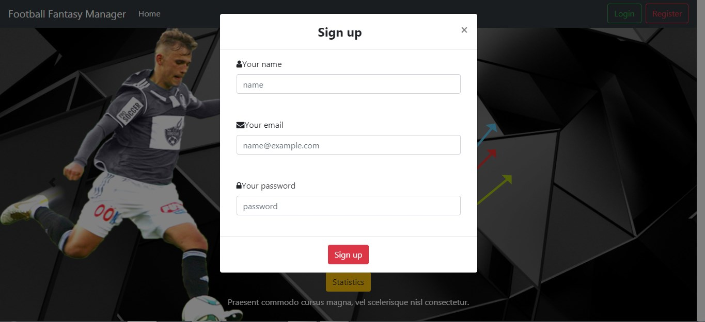
Откако ќе се регистрира ќе треба да се најави 
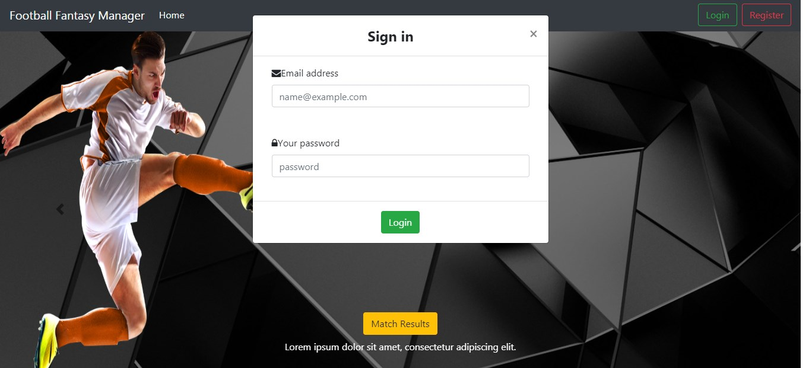

 
За да креирате тим потребно е да одберето Create Team во навигациското мени. 

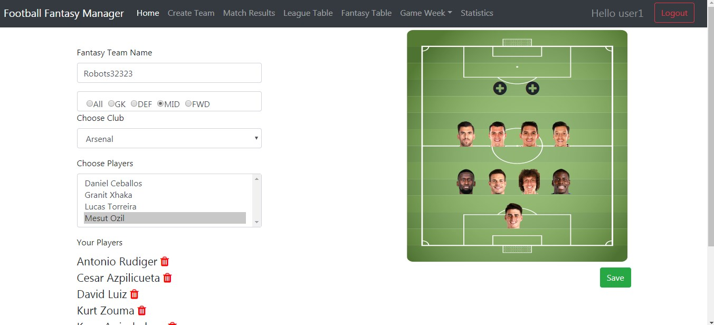

 

Потребно е прво да се одбере позиција па потоа да се одбере еден од играчите од листата понудени
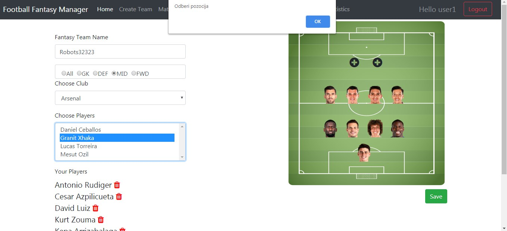

 

За да го зачувате тимот треба да се притисни копчето Save. 

 

Пред почетокот на сезоната корисниците ќе треба да ги креираат своите тимови.
После секое коло админот ќе треба да ги внесе натпреварите врз основа на изиграните натпревари во Англиската Премиер Лига.
 
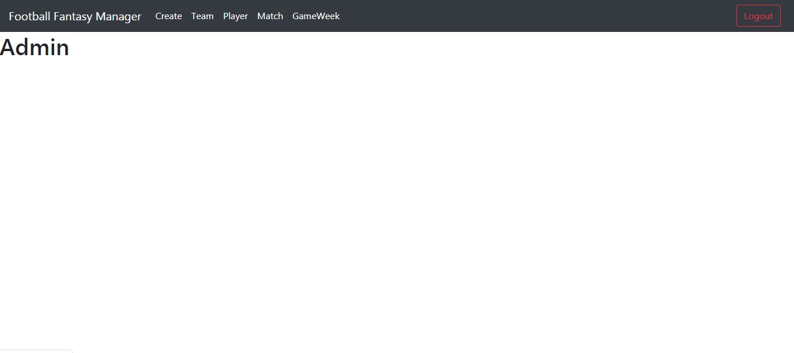

 
Админот ќе може да креира тимови за наредните сезони и да додава играчи доколку има некои трансфери. 

Админот ќе може да креира натпревари
Внесува два тима,играчи кои постигнале голови и асистенции и резултатот од натпреварот.
врз основа на овие параметри се пресметуваат бодови за виртуелните тимови на следниот начин: 
доколку тимот на играчот кој што е избран во виртуелниот тим победи играчот добива + 3 ако е нерешено + 1 дололку изгуби тимот нема поени.  
за постигнат гол +5 поени 
за асистенција + 3 поени 

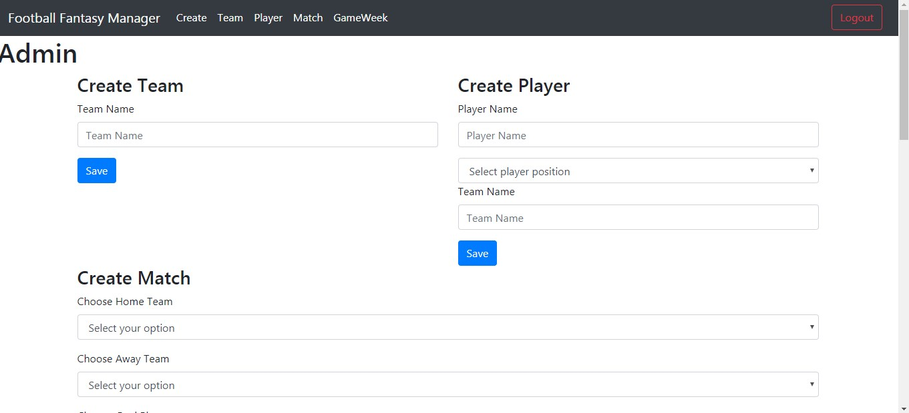 
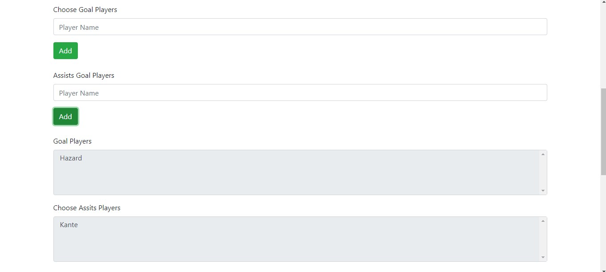 

 

Потребно е да се зачуваат сите внесени информаци на копчето Save по што следува валидација доколку се е успешно ќе се прикаже зелен дијалог доколку не црвен. 
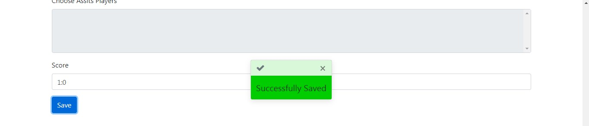 

Админот креира Коло
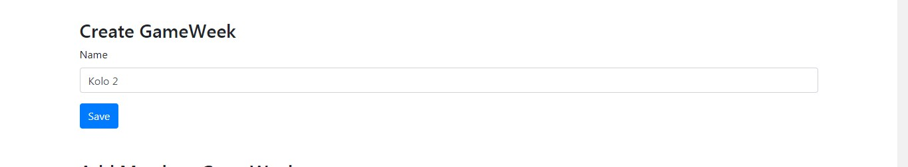 

Админот го внесува натпреварот во колото.
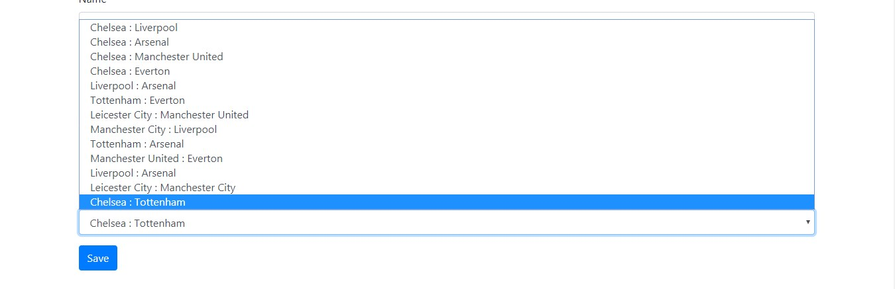 

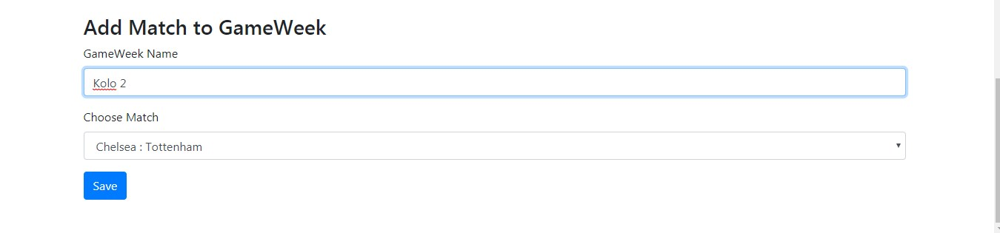 

Доколку за било каков проблем потребно е менување на податоците како на пример: 
тимот падне во втора лига 
играчот направи трансфер во друга лига 
админот внесе погрешни податоци 
админот ќе може тоа да го семени: 

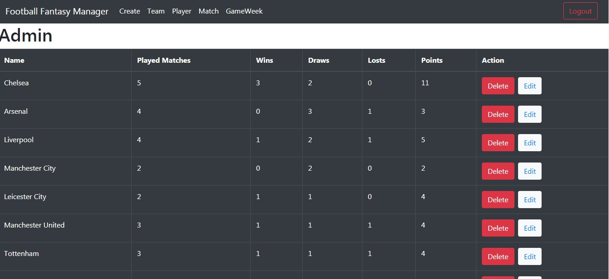 

 
Со одбирање на Edit копчето. 
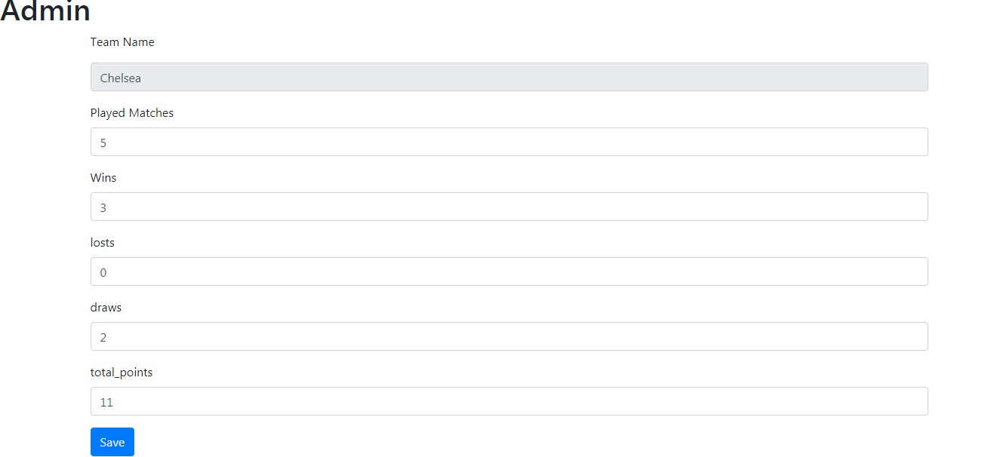
 

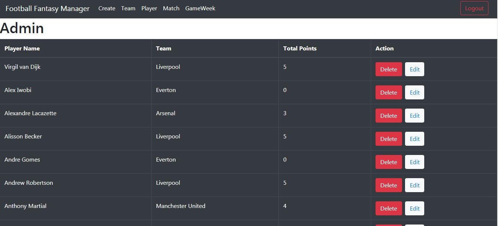 

 
Со одбирање на Edit копчето. 
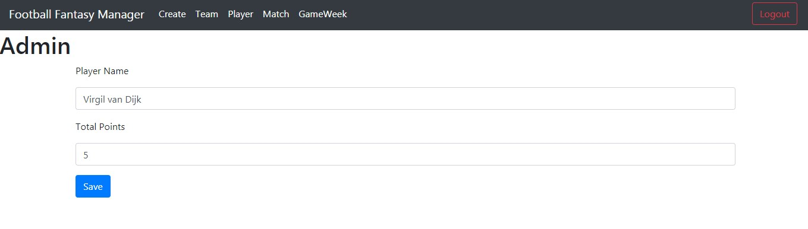
 

 

 
Со одбирање на Edit копчето. 
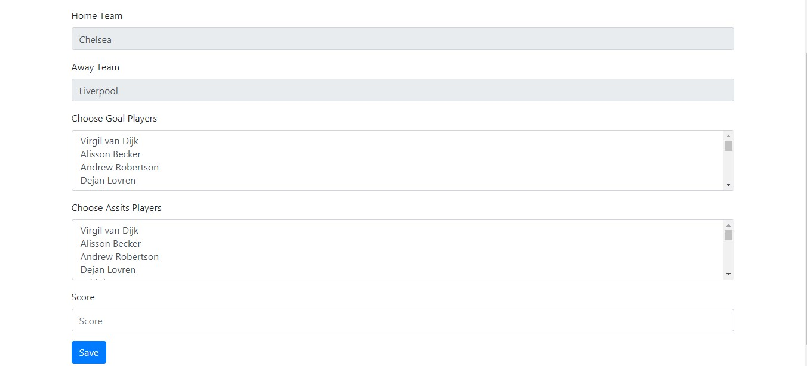
 

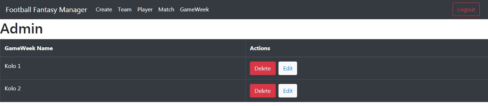 

