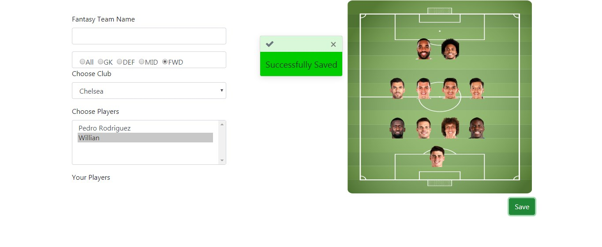

##Александар Крстевски 156013 Овој проект е семинарска по предметот веб програмирање на факултетот ФИНКИ 

Во ова git repository постои база која е пополнета со примери(тимови,играчи,натпревари,админ,корисник)

1.potrebno e FootballManager.mdf i FootballManager_log da gi stavite na
slednata pateka: 
C:\Program Files (x86)\Microsoft SQL Server\MSSQL12.SERVERSQL2014\MSSQL\DATA
 
2.Otvarate Microsoft SQL Server Studio 
3.se najavuvate so Windows Authentication 
4.desen klik na Database pa klikate Attach 
5.Klikate Add pa go odbirate FootballManager.mdf pa potoa Ok pa povtorno Ok 
6.Go otvarate proektot MSR vo IntelliJ kako java springboot aplikacija 
7.vo IntelliJ vo application.properties gi stavate vasite podatoci za username i password spored SQL Server Authentication najavata vo
Microsoft SQL Server Studio 
spring.datasource.username=??? 
spring.datasource.password=??? 
8.Go otvarate proektot virtual-football-manager kako react-Js aplikacija i klikate na dijalogot npm-install  
9.gi startuvate dvete 

админот е alek.krstevski@mail.com
лозинката е 123456

корисник е name@example.com
лозинката е 123456

Овој проект преставува online игра каде корисниците ќе можат да креираат виртуелен фудбалски тим и да добиваат поени според  резултатите од вистински фудбалски натпревари. 
Во оваа игра корисниците ќе можат да креираат виртуални тимови со играчи од Англиската Премиер Лига. 

 

 
За да еден корисник учествува во оваа игра потребно е да се регистрира и да креира виртуален тим. 

Откако ќе се регистрира ќе треба да се најави 

 
За да креирате тим потребно е да одберето Create Team во навигациското мени. 

 

Потребно е прво да се одбере позиција па потоа да се одбере еден од играчите од листата понудени

 

За да го зачувате тимот треба да се притисни копчето Save. 

 

Пред почетокот на сезоната корисниците ќе треба да ги креираат своите тимови.
После секое коло админот ќе треба да ги внесе натпреварите врз основа на изиграните натпревари во Англиската Премиер Лига.
 

 
Админот ќе може да креира тимови за наредните сезони и да додава играчи доколку има некои трансфери. 

Админот ќе може да креира натпревари
Внесува два тима,играчи кои постигнале голови и асистенции и резултатот од натпреварот.
врз основа на овие параметри се пресметуваат бодови за виртуелните тимови на следниот начин: 
доколку тимот на играчот кој што е избран во виртуелниот тим победи играчот добива + 3 ако е нерешено + 1 дололку изгуби тимот нема поени.  
за постигнат гол +5 поени 
за асистенција + 3 поени 

 
 

 

Потребно е да се зачуваат сите внесени информаци на копчето Save по што следува валидација доколку се е успешно ќе се прикаже зелен дијалог доколку не црвен. 
 

Админот креира Коло
 

Админот го внесува натпреварот во колото.
 

 

Доколку за било каков проблем потребно е менување на податоците како на пример: 
тимот падне во втора лига 
играчот направи трансфер во друга лига 
админот внесе погрешни податоци 
админот ќе може тоа да го семени: 

**Team** 
 

 
Со одбирање на Edit копчето. 

 

**Player** 
 

 
Со одбирање на Edit копчето. 

 

**Match**  
 

 
Со одбирање на Edit копчето. 

 

**GameWeek**  
 
 

Најавениот корисникот ќе може да ги гледа натпреварите и резулататите.
 

Најавениот корисникот ќе може да ја гледа моменталната табела на Англиската Премиер Лига
 

Најавениот корисникот ќе може да ги гледа натпреварите по кола со одбирање на натпреватот ке може да ги види играчите кои постигнале погодок.
 

Најавениот корисникот ќе може да ги гледа табела од сите виртуални тимови.
 

Најавениот корисникот ќе може да ги види: 
Најдобрите 10 играчи  
5 Тимовите кои постигнале највеќе голови 
 
 

