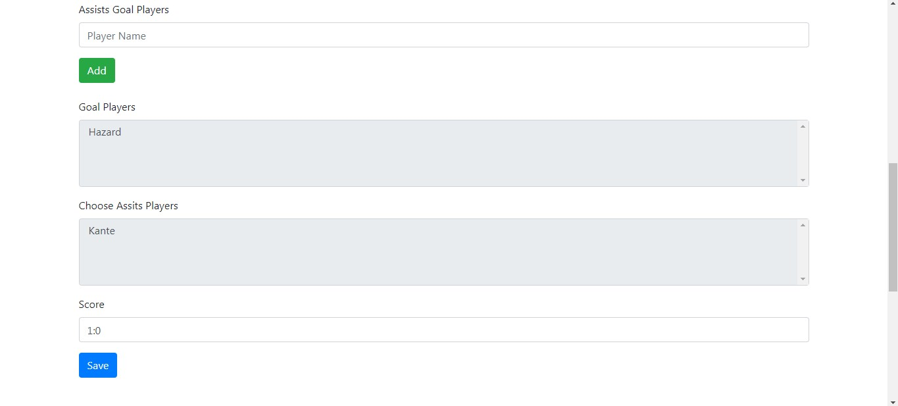
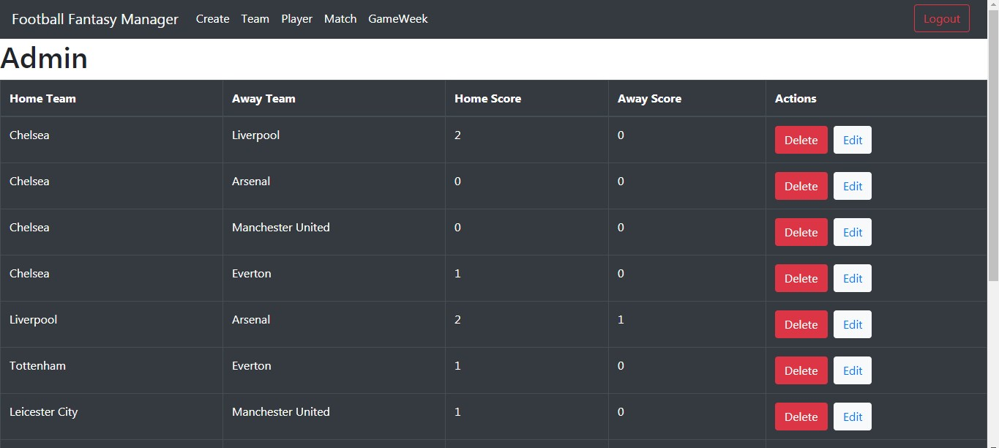

Technology: 
SpringBoot 
ReactJs 
Microsoft SQL 
d3.js 
jQuery 
 

This project represents an online game where users will be able to create a virtual football team and receive points according to the results of real football matches. 
In this game users will be able to create virtual teams with players from the English Premier League. 

 

 
In order for a user to participate in this game, it is necessary to register and create a virtual team. 

After registering you will need to log in 

 
To create a team you need to select Create Team in the navigation menu. 

 

It is necessary to first select a position and then select one of the players from the list offered

 

To save the team, press the Save button. 

 

Before the start of the season, users will have to create their teams.
After each round the admin will have to enter the matches based on the matches played in the English Premier League.
 

 
The admin will be able to create teams for the upcoming seasons and add players if there are any transfers. 

Admin will be able to create matches
Enter two teams, players who scored goals and assists and the result of the match.
based on these parameters, points are calculated for the virtual teams in the following way: 
if the team of the player who is selected in the virtual team wins, the player gets + 3 if it is a draw + 1 if the team loses, there are no points.  
for a scored goal +5 points 
for assistance + 3 points 

 
 

 

It is necessary to save all entered information on the Save button, followed by validation, if everything is successful, a green dialog will be displayed, if not red. 
 

The admin creates a Circle
 

The admin enters the match into the round.
 

 

If for any problem it is necessary to change the data, for example: 
the team falls into the second league 
the player made a transfer to another league 
admin entered wrong data 
the admin will be able to change it: 

**Team**
 

 
By selecting the Edit button. 

 

**Player**
 

 
By selecting the Edit button. 

 

**Match**
 

 
By selecting the Edit button. 

 

**GameWeek**
 
 

The logged in user will be able to watch the matches and the results.
 

The logged in user will be able to view the current table of the English Premier League
 

The logged in user will be able to watch the matches by round by selecting the match, he will be able to see the players who scored a goal.
 

The logged in user will be able to see the table of all virtual teams.
 

The logged in user will be able to see: 
Top 10 players  
5 The teams that scored the most goals 
 
 

Во ова git repository постои база која е пополнета со примери(тимови,играчи,натпревари,админ,корисник)

potrebno e da imate SQL Server Authentication acount
bidejki driverot sto go imam na mmojot lap-top ne podrzuva windows integrated authentication ne znam kaj vas. 

1.potrebno e FootballManager.mdf i FootballManager_log da gi stavite na
slednata pateka: 
C:\Program Files (x86)\Microsoft SQL Server\MSSQL12.SERVERSQL2014\MSSQL\DATA
 
2.Otvarate Microsoft SQL Server Studio 
3.se najavuvate so Windows Authentication 
4.desen klik na Database pa klikate Attach 
5.Klikate Add pa go odbirate FootballManager.mdf pa potoa Ok pa povtorno Ok 
6.Go otvarate proektot MSR vo IntelliJ kako java springboot aplikacija 
7.vo IntelliJ vo application.properties gi stavate vasite podatoci za username i password spored SQL Server Authentication najavata vo
Microsoft SQL Server Studio 
spring.datasource.username=??? 
spring.datasource.password=??? 
8.Go otvarate proektot virtual-football-manager kako react-Js aplikacija i klikate na dijalogot npm-install  
9.gi startuvate dvete 

dokolku vi se pojavat slednite greski:

● The database FootballManager is not accessible vo Microsoft SQL Server Studio (dokolku se obiduvate da napravite select):
 potrebno e da se startuva Microsoft SQL Server Studio kako Administrator i so windows Authentication da mu dodelite na acount da gi ima site permisii vo Security 
Login desen klik na accountot Properties 
User Mapping i Server Roles stiklirajte se
 
● "Connection refused: connect. Verify the connection properties. Make sure that an instance of SQL Server is running on the host and accepting TCP/IP connections at the port. Make sure that TCP connections to the port are not blocked by a firewall."
 
Vo 
SQL Server Configuration Manager 
SQL Server Network Configuration 
Protocols for .. (site 3 da bidat enable) 
desen klik na TCP/IP 
Properties 
Ip/Adress 
najdole TCP port postavete go na 1433 

● Dokolku se kreiraat dopolnitelni prazni tabeli i servisite vrakaat prazni rezultati 
(hibernate ne moze da gi prepoznae tabelite vo bazata) potrebno e na sekoj model pred imeto da dodadete alek.
na primer za @Table(name = "FantasyTeams") ke treba  @Table(name = "alek.FantasyTeams")
dokolku se pojavat dopolnitelni exceptions ignorirajte gi 
//(spring.jpa.properties.hibernate.hbm2ddl.jdbc_metadata_extraction_strategy=individually kazuva dali tabelite se pronajdeni)

● com.microsoft.sqlserver.jdbc.SQLServerException: This driver is not configured for integrated authentication. ClientConnectionId:212c09c9-4b93-4a11-92cc-b3bb96d96899
 
potrebno e da imate SQL Server Authentication acount
bidejki driverot sto go imam na mmojot lap-top ne podrzuva windows integrated authentication. 

админот е alek.krstevski@mail.com
лозинката е 123456

корисник е name@example.com
лозинката е 123456

